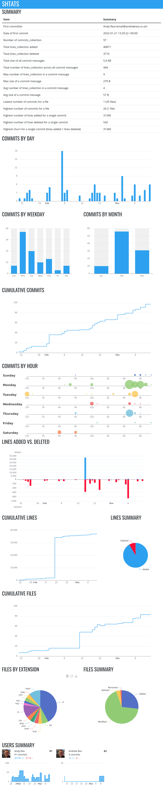

# shtats

A tool to visualise stats from GIT.

## Platforms

Linux, Mac and Windows

## Credits

### Github Actions
This repo was cloned originally from [https://github.com/nicolas-van/rust-cross-compile-example](https://github.com/nicolas-van/rust-cross-compile-example) which contained working examples of compiling in Linux, Windows and Mac inside Github Actions.

### Style and Layout
Twitter bootstrap - [https://getbootstrap.com/](https://getbootstrap.com/)

### Charts
Apache echarts - [https://echarts.apache.org](https://echarts.apache.org/en/index.html)

### Report
Mustache for the server side rendering - [https://docs.rs/ramhorns/latest/ramhorns/](https://docs.rs/ramhorns/latest/ramhorns/)

Preact with hooks for the client side - [https://preactjs.com](https://preactjs.com/guide/v10/hooks/)

Visualising using Storybook - [https://storybook.js.org/](https://storybook.js.org/)

### Command Line Args Parser

CLAP - [https://github.com/clap-rs/clap](https://github.com/clap-rs/clap)
